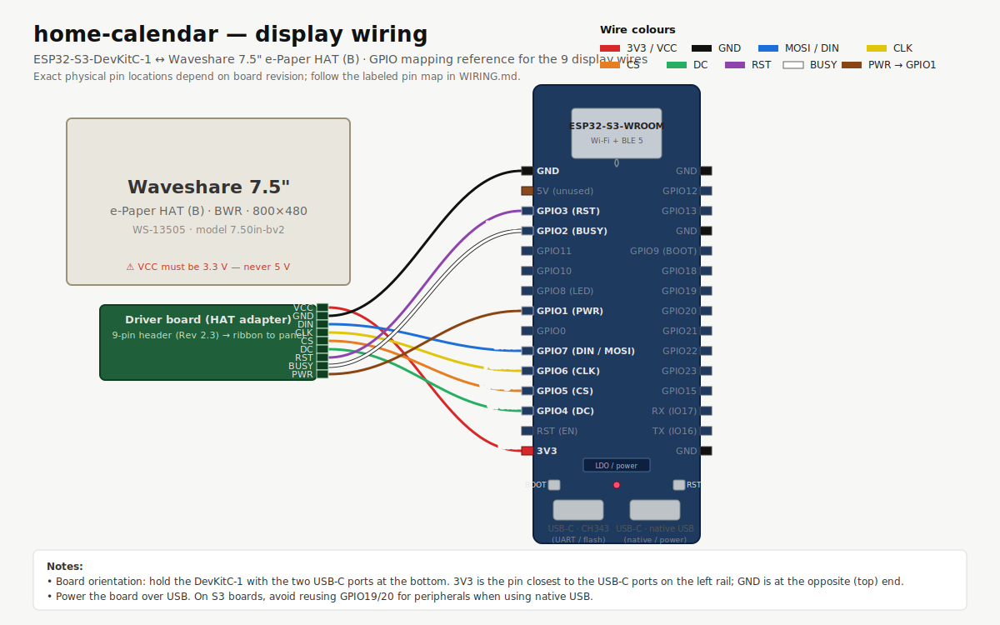

# Home Calendar — ESPHome on ESP32-S3 DevKitC-1

A wall-mounted Google Calendar display on a Waveshare 7.5" black/white/red
e-ink panel, driven by an ESP32-S3 DevKitC-1 (Heemol N16R8) running **ESPHome** under Home
Assistant. Home Assistant's built-in Google Calendar integration does the
OAuth and event fetching; a template sensor pushes the events list to the
device over the native API.

Source: <https://github.com/alal76/home-calendar>

**New build? Start with [INSTALL.md](INSTALL.md)** for the complete parts
list, wiring, Home Assistant setup, and firmware configuration walkthrough.

```
Google Calendar ──► Home Assistant (your HA host, e.g. homeassistant.local:8123)
                       │  • Google Calendar integration  (OAuth + polling)
                       │  • template sensor every 5 min
                       │      sensor.calendar_events_json  (attribute: events)
                       ▼
                  ESPHome native API
                       │
                       ▼
                  esp32connector (esp32connector.local)  ──►  7.5" BWR panel
                                                       renders 800×480 layout
```

> The device gets its IP from DHCP, which can change — always address it by
> its mDNS hostname (`${device_name}.local`, i.e. `esp32connector.local` by
> default) rather than a hardcoded IP. Change `substitutions.device_name` in
> [esp32connector.yaml](esphome/esp32connector.yaml) to rename it everywhere
> at once. For a predictable numeric IP, set a DHCP reservation for the
> device's MAC address on your router instead of hardcoding one in docs.

The ESP32 never talks to Google directly — only to Home Assistant.

---

## Repository layout

```
home-calendar/
├── esphome/
│   ├── esp32connector.yaml          ← the device firmware (ESPHome YAML)
│   ├── components/preview_page/     ← local external_component
│   │                                  serving GET /preview + /dash
│   ├── secrets.example.yaml         ← keys to add to /config/esphome/secrets.yaml
│   └── README.md                    ← deploy steps + HA template-sensor snippet
├── scripts/                         ← dev helpers, incl. preview-display.sh, which
│                                       generates a git-ignored local preview.html
│                                       (never commit it — it mirrors live HA data)
├── docs/                            ← wiring diagram SVGs
├── INSTALL.md                       ← complete install + build guide
├── WIRING.md                        ← pin map + cabling reference
├── CLAUDE.md                        ← persistent Claude Code context
└── .github/
    └── copilot-instructions.md      ← persistent Copilot context
```

---

## Quick start

**Building this for the first time? Use [INSTALL.md](INSTALL.md)** — the
complete, no-steps-skipped guide: parts list, wiring, Home Assistant setup,
per-household firmware configuration, first flash, and verification. The
summary below assumes you've already read it.

1. **Home Assistant**: add the Google Calendar integration (**Settings →
   Devices & Services → + Add Integration → Google Calendar**), then add the
   template sensor + refresh script from
   [esphome/README.md](esphome/README.md#2-add-the-template-sensor--refresh-script-to-ha)
   pointed at your own calendars. Confirm
   `sensor.calendar_events_json` populates with an `events` attribute.
2. **Firmware**: edit the `substitutions:` block at the top of
   [esp32connector.yaml](esphome/esp32connector.yaml) with your own device
   name, timezone, HA entity ids, and household members (see
   [INSTALL.md § 4](INSTALL.md#4-configure-the-firmware-for-your-household)
   for the full list) — nothing else needs to change for a standard install.
3. **Flash**: ESPHome dashboard → paste in the yaml → **INSTALL → Plug into
   this computer** for a first flash, **Wirelessly** for every update after.
4. **Pair with HA** (if not auto-discovered): **Settings → Devices &
   Services → + Add Integration → ESPHome** — mDNS-discovered or entered
   manually by hostname/IP + port `6053`. Fully UI-driven, no
   `configuration.yaml` editing required.

---

## How it works

| Layer       | Component                                                       |
|-------------|-----------------------------------------------------------------|
| Calendar    | Home Assistant Google Calendar integration (OAuth + token refresh) |
| Bridge      | HA template sensor `sensor.calendar_events_json` (5-min trigger) re-runs `calendar.get_events` (-7d to +90d window) and stashes the result in an `events` attribute |
| Transport   | ESPHome native API (encrypted) — device subscribes to the sensor attribute |
| Device      | ESP32-S3 DevKitC-1 (Heemol N16R8) + Waveshare 7.5" HAT (B), pins in [WIRING.md](WIRING.md) |
| Firmware    | ESPHome YAML + lambdas (see [esphome/esp32connector.yaml](esphome/esp32connector.yaml)) |
| Web preview | Local `preview_page` external component exposes `GET /preview` + `/dash` on port 80 — JS-rendered SVG mirror of the e-paper layout |
| Presence    | HA Companion App on each phone publishes `person.*` (and optionally `sensor.*_speed`); device subscribes and renders zone + speed |
| Weather     | HA Met.no built-in (`weather.forecast_home`) — current condition + temperature |
| Refresh     | 5-min HA cadence + on-demand `button.refresh_calendar` + full repaint (~15 s) |

### Display layout (800×480)

```
┌────────────────────────────┬───────────────────┐   header strip
│ Jun – Jul 2026   [<] [today] [>] │   Upcoming        │
├────────────────────────────┤                   │
│  Mo Tu We Th Fr Sa Su            │  Today · 14:30    │
│  rolling 5-week grid             │  Tomorrow · 09:00 │   568 px grid
│  (anchor row 3 = today's week)   │  …                │   232 px sidebar
│                                  │                   │
├────────────────────────────┴───────────────────┤
│ Updated …   3 past   1 today   13 upcoming           │   80 px footer
│ Next: 06 Jul · in 8d — Dentist appointment           │
│ WiFi … · IP … · Up …         esp32connector v1.2.0  │
│ Person A: home · Person B: work · Person C: school · Person D: not_home
└─────────────────────────────────────────────────┘
```

- **5-week rolling window** — today is always in row 3; cells span
  −2 weeks back to +2 weeks forward. Month boundaries show a small red
  month label on the day-1 cell.
- **Red** is used for accents only: header strip, today circle, event dots,
  sidebar date labels.
- **Footer row 4** shows each tracked person as `Label: zone (NN km/h)`. The
  speed suffix is omitted if the speed sensor is unavailable or < 1 m/s.
- **Version** is exposed to HA as the diagnostic
  `sensor.<device>_home_calendar_version` — sourced from
  `substitutions.sw_version` in [esp32connector.yaml](esphome/esp32connector.yaml)
  (currently `1.2.0`; bump that substitution, don't hardcode the number here).

---

## Wiring

S3 display wiring: [docs/wiring-display-s3.svg](docs/wiring-display-s3.svg).
Legacy C6 full wiring (kept for reference):
[docs/wiring-diagram-c6.svg](docs/wiring-diagram-c6.svg).

[](docs/wiring-display-s3.svg)

All connections are female-to-female 2.54 mm dupont jumpers, no soldering
required. See [WIRING.md](WIRING.md) for the same data in plain tables and
the wire-colour convention used in the diagram.

### E-paper display (Waveshare 7.5" BWR HAT — required)

| HAT pin | Signal | ESP32-S3 | Wire |
|---------|--------|--------------|------|
| VCC     | 3.3 V  | **3V3**      | red |
| GND     | Ground | **GND**      | black |
| DIN     | MOSI   | **GPIO7**    | blue |
| CLK     | SPI clock | **GPIO6** | yellow |
| CS      | Chip select | **GPIO5** | orange |
| DC      | Data/command | **GPIO4** | green |
| RST     | Reset  | **GPIO3**    | purple |
| BUSY    | Busy   | **GPIO2**    | grey |

> ⚠️ VCC **must** be 3.3 V — never 5 V. The panel is the only required peripheral.

### Manual refresh button (recommended)

Use the on-board **BOOT** button (`GPIO0`) by default; no external wiring needed.

Mapped to `button.refresh_calendar` in HA. Internal pull-up is already handled.

### Audio out — MAX98357A I²S DAC + 4–8 Ω speaker (optional)

| DAC pin | ESP32-S3 | Wire |
|---------|--------------|------|
| VIN     | **3V3**      | red |
| GND     | **GND**      | black |
| BCLK    | **GPIO15**   | blue |
| LRC     | **GPIO16**   | yellow |
| DIN     | **GPIO17**   | orange |
| SPK+/SPK− | speaker terminals | — |

### Microphone — INMP441 I²S MEMS (optional)

| Mic pin | ESP32-S3 | Wire |
|---------|--------------|------|
| VDD     | **3V3**      | red |
| GND     | **GND**      | black |
| SCK     | **GPIO18**   | blue |
| WS      | **GPIO45**   | yellow |
| SD      | **GPIO14**   | orange |
| L/R     | **GND**      | black (tied to GND for left-channel) |

### Reserved / free pins

| GPIO    | Status                                                |
|---------|-------------------------------------------------------|
| GPIO0   | **Reserved** — BOOT strap button (on-board)           |
| GPIO20  | **Reserved** — native USB D−                          |
| GPIO21  | **Reserved** — native USB D+                          |
| GPIO43/44 | **Reserved** — UART0 TX/RX (USB-serial / first-flash) |
| GPIO48  | **Reserved** — onboard RGB status LED                 |
| GPIO8, GPIO9, GPIO10-13, GPIO15-19, GPIO35-38, GPIO45-47 | Free for expansion |

### Power

Single USB-C into either port — bottom **native USB-C** for wall power, top
**CH343** port for flashing via cable to a host. Both provide 5 V to the
onboard regulator; the display ties off the regulated 3.3 V rail.

---

## Updating the calendar layout

All rendering lives in the `display:` lambda in [esphome/esp32connector.yaml](esphome/esp32connector.yaml).
Edit it in the ESPHome dashboard, click **INSTALL** to OTA the change.

Common tweaks are listed in the "Things you'll likely need to tweak" table in
[esphome/README.md](esphome/README.md).

---

## Forcing an immediate refresh

The yaml exposes `button.refresh_calendar` in Home Assistant. Press it from
the device card, from a Lovelace tile, or via service call `button.press` —
the device calls HA's `script.refresh_home_calendar`, which re-fires the
template-sensor trigger, which pushes a fresh events list to the device,
which forces a display repaint without waiting for the 5-min cadence.

---

## History

This project started as Arduino firmware built with pioarduino + GxEPD2 +
ESPAsyncWebServer. After the device was adopted into Home Assistant via
ESPHome, the entire C++ codebase was retired in favour of the ESPHome YAML
above. An OpenClaw skill on a Proxmox VM briefly handled the Google
OAuth before being replaced by Home Assistant's native Google Calendar
integration. The Arduino code and OpenClaw scaffolding are preserved only in
git history.
